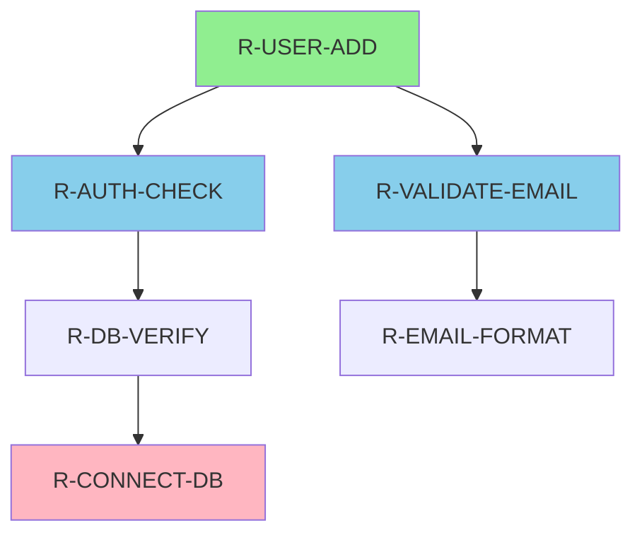

# ARCHITEKTUR: Technisches Design der Wissensdatenbank

**Version**: 1.0  
**Status**: Approved  
**Datum**: 2026-03-23

---

## 1. Überblick

Die Wissensdatenbank ist ein **verteiltes, Git-basiertes System** ohne zentrale Datenbank. Alle Routinen sind Markdown-Dateien mit strukturierten YAML-Metadaten.

```
┌─────────────────────────────────────────────┐
│     Wissensdatenbank (Knowledge Base)       │
├─────────────────────────────────────────────┤
│                                              │
│  docs/handbuch/                              │
│  ├── routinen/          (Aktive Routinen)    │
│  ├── templates/         (Vorlagen)           │
│  └── archiv/            (Deprecated)         │
│                                              │
│  Versionskontrolle: Git (GitHub)             │
│  Format: Markdown + YAML Frontmatter         │
│                                              │
└─────────────────────────────────────────────┘
```

---

## 2. Datenmodell

### 2.1 Routine-Entität

```yaml
Routine
├── Metadata (YAML Frontmatter)
│   ├── id: "R-[DOMAIN]-[ACTION]"
│   ├── category: "kurzfristig | mittelfristig | langfristig"
│   ├── complexity: "einfach | mittel | komplex"
│   ├── status: "aktiv | deprecated | experimental"
│   ├── dependencies: [List<Routine-ID>]
│   ├── tags: [List<String>]
│   └── versionInfo: {version, createdAt, updatedAt, author}
│
└── Content (Markdown)
    ├── Zusammenfassung
    ├── Anwendungsfall
    ├── Schritt-für-Schritt
    ├── Code-Examples
    ├── Fehlerbehandlung
    ├── Performance-Infos
    ├── Related Routines
    └── Qualitäts-Checkliste
```

### 2.2 Abhängigkeits-Graph

```
Definition: 
  - A → B bedeutet: "A benötigt B als Voraussetzung"
  - A ist die Abhängige (dependent)
  - B ist die Abhängigkeit (dependency)

Beispiel:
  R-USER-ADD 
    → R-VALIDATE-EMAIL (Voraussetzung)
    → R-DB-INSERT (Nachfolgeoperation)
    → R-LOG-EVENT (Optional)

Constraints:
  - KEINE zirkulären Abhängigkeiten
  - Max. Abhängigkeitstiefe: 5 Level
  - Alle Dependencies müssen existierende Routine-IDs sein
```

### 2.3 Kategorisierungshierarchie

```
Routinen
├── KURZFRISTIG (täglich, < 15 Min)
│   ├── Authentifizierung (R-AUTH-*)
│   ├── Daten-Lookup (R-LOOKUP-*)
│   └── Quick-Actions (R-QUICK-*)
│
├── MITTELFRISTIG (monatlich, 15 Min - 4h)
│   ├── Datenpflege (R-MAINT-*)
│   ├── Reports (R-REPORT-*)
│   └── Backups (R-BACKUP-*)
│
└── LANGFRISTIG (quartals-/jährlich, > 4h)
    ├── Migrationen (R-MIGRATE-*)
    ├── Architektur-Updates (R-ARCH-*)
    └── Große Refactorings (R-REFACTOR-*)
```

---

## 3. System-Architektur

### 3.1 Component Diagram

```
┌─────────────────────────────────────────────────────────┐
│                  Presentation Layer                     │
│  (GymWindow, PlanWindow, Benutzer-Interfaces)           │
└─────────────────────────────────────────────────────────┘
                           ↕
┌─────────────────────────────────────────────────────────┐
│              Knowledge Base APIs                        │
│  - Search(query): List<Routine>                         │
│  - GetRoutine(id): Routine                              │
│  - ListByCategory(cat): List<Routine>                   │
│  - ValidateDependencies(routine): ValidationResult     │
└─────────────────────────────────────────────────────────┘
                           ↕
┌─────────────────────────────────────────────────────────┐
│           Knowledge Base Manager                        │
│  - Load routines from /docs/handbuch                   │
│  - Parse YAML frontmatter                              │
│  - Build dependency graph                              │
│  - Cache & Index                                       │
│  - Detect duplicates                                   │
└─────────────────────────────────────────────────────────┘
                           ↕
┌─────────────────────────────────────────────────────────┐
│             Git-basierter Storage Layer                 │
│  - Lesen: Markdown-Dateien aus /docs/handbuch/routinen │
│  - Versionierung: Git commits + history                │
│  - Suchindex: Lokale Dateisystem-Suche oder Lucene    │
└─────────────────────────────────────────────────────────┘
```

### 3.2 Daten-Flow

```
1. ROUTINE CREATION
   User
     ↓
   Template kopieren (templates/ROUTINE-TEMPLATE.md)
     ↓
   Inhalt ausfüllen (YAML + Markdown)
     ↓
   Pre-Submission Checks (lint, validate)
     ↓
   Code Review
     ↓
   Git commit → routinen/R-XYZ.md
     ↓
   KB Manager laden → Caches aktualisieren
     ↓
   Index updaten → Suchbar

2. ROUTINE USAGE
   System/User
     ↓
   KB.Search("suchtext") 
     ↓
   Index-Lookup → gefundene Routinen
     ↓
   Dependencies auflösen
     ↓
   Routine laden + Abhängigen laden
     ↓
   Nutzer folgt den Schritten
     ↓
   Feedback/Logging

3. ROUTINE UPDATE
   User erkannt: Veraltete Routine
     ↓
   Git branch erstellen (R-XYZ-update)
     ↓
   Änderungen vornehmen + Version bumpen
     ↓
   Code Review
     ↓
   Git merge → main
     ↓
   Versionhistorie automatisch aktualisiert
```

---

## 4. Implementierungs-Details

### 4.1 Datei-Format (Markdown + YAML)

```markdown
---
id: "R-USER-ADD"
title: "Benutzer hinzufügen"
category: "kurzfristig"
complexity: "einfach"
timeEstimate: "15min"
status: "aktiv"
tags: ["user", "admin", "database"]
dependencies:
  - "R-AUTH-CHECK"
  - "R-VALIDATE-EMAIL"
createdAt: "2026-03-20"
updatedAt: "2026-03-23"
author: "TeamMember1"
reviewedBy: "TeamMember2"
version: "1.0.0"
---

# Benutzer hinzufügen

## Zusammenfassung
Diese Routine fügt einem neuen Mitglied ein Benutzerkonto...

[REST OF MARKDOWN CONTENT]
```

### 4.2 Datei-Layout

```
docs/handbuch/
├── 00-PFLICHTENHEFT.md           ← Anforderungs-Dokument
├── 01-ROADMAP.md                 ← Zeitplan & Meilensteine
├── 02-ARCHITEKTUR.md             ← Diese Datei
├── 03-GUIDELINES.md              ← Best Practices
├── README.md                     ← Übersicht & Navigation
│
├── routinen/                     ← AKTIVE ROUTINEN
│   ├── KURZFRISTIG.md            ├─ Übersichts-Index
│   ├── MITTELFRISTIG.md          ├─ Übersichts-Index
│   ├── LONGFRISTIG.md            ├─ Übersichts-Index
│   ├── R-AUTH-LOGIN.md           ├─ Einzelne Routine
│   ├── R-USER-ADD.md             ├─ Einzelne Routine
│   ├── R-DB-BACKUP.md            ├─ Einzelne Routine
│   └── ...
│
├── templates/                    ← VORLAGEN FÜR NEUE ROUTINEN
│   ├── ROUTINE-TEMPLATE.md       ├─ Standard-Template
│   ├── CHECKLISTE-VORLAGE.md     ├─ QS-Checkliste
│   └── MACHBARKEITSANALYSE.md    ├─ Für große Routinen
│
└── archiv/                       ← VERALTETE ROUTINEN (readonly)
    └── R-OLD-LOGIN-v1.md
```

---

## 5. Abhängigkeits-Management

### 5.1 Dependency Resolution

**Manual Check**:
```
R-USER-ADD.md überprüfen:
  - dependencies: ["R-AUTH-CHECK", "R-VALIDATE-EMAIL"]
  
  Lookup R-AUTH-CHECK:
    - Status: ✅ aktiv
    - Exist: ✅ ja
  
  Lookup R-VALIDATE-EMAIL:
    - Status: ✅ aktiv
    - Exist: ✅ ja
  
  Conclusion: ✅ All dependencies OK
```

**Automated Check (Pseudocode)**:
```python
def validate_dependencies(routine_id):
    routine = load_routine(routine_id)
    
    for dep_id in routine.dependencies:
        dep = load_routine(dep_id)
        
        if not exists(dep):
            raise DependencyResolutionError(
                f"Dependency {dep_id} not found"
            )
        
        if dep.status == "deprecated":
            warn(f"Using deprecated routine {dep_id}")
        
        # Recursive check
        validate_dependencies(dep_id)
    
    # Cycle detection
    if detect_cycle(routine_id):
        raise CircularDependencyError(routine_id)
    
    return True
```

### 5.2 Dependency Graph Visualization

**Tool**: Mermaid.js (automatisierte Graphen)



---

## 6. Performance & Caching

### 6.1 Caching-Strategie

```
Layer 1: In-Memory Cache (RuntimeCache)
  - Häufig genutzte Routinen
  - TTL: 1 Stunde
  - Hit Rate Goal: > 80%

Layer 2: Index Cache (File-based)
  - Vollständiger Routine-Index
  - Generated on: Startup, nach jedem Commit
  - TTL: Until repository change

Layer 3: Git Repository (Disk)
  - Single source of truth
  - Versionskontrolliert
  - Durchsuchbar mit git log
```

### 6.2 Indizierung

```
Index-Struktur:
├── Routine ID → Routine-Objekt
├── Tags → [Routine-IDs]
├── Category → [Routine-IDs]
├── Status → [Routine-IDs]
└── Word Index (für Volltextsuche)
    └── "login" → [R-AUTH-LOGIN, R-USER-LOGIN, ...]
```

**Update-Trigger**:
```
File System Watcher (Optional)
  └─ Detect: Neue/Geänderte Dateien in docs/handbuch/
  └─ Action: Index + Cache refresh
  └─ Latency: < 1 Sekunde
```

---

## 7. Sicherheits-Architektur

### 7.1 Access Control

```yaml
Datei-Ebene (Git):
  - Read: Alle (public repo / internal)
  - Write: Nur Team-Members via Pull Request
  - Admin: Nur Code Owners

Routine-Ebene:
  - Sensitive Data: Keine Secrets in Routinen!
  - Audit: Git log + Commit signatures
  - Enforcement: Pre-commit hooks validate
```

### 7.2 Validation & Sanitization

```python
def validate_routine_on_commit(routine_file):
    """Pre-commit hook"""
    
    # 1. YAML Syntax
    yaml_valid = validate_yaml(routine_file)
    
    # 2. Required Fields
    metadata_valid = has_required_fields(routine_file)
    
    # 3. No Secrets
    has_secrets = scan_for_secrets(routine_file)
    
    # 4. Unique ID
    id_unique = check_unique_id(routine_file.id)
    
    # 5. Dependencies Exist
    deps_valid = check_all_dependencies_exist(routine_file.dependencies)
    
    # 6. No Cycles
    no_cycles = cycle_detection(routine_file.id)
    
    return all([yaml_valid, metadata_valid, not has_secrets, 
                id_unique, deps_valid, no_cycles])
```

---

## 8. Skalierbarkeit

### 8.1 Wachstums-Projektionen

| Zeitpunkt | Routinen-Count | Index-Größe | Performance |
|-----------|---|---|---|
| Start (2026-Q2) | 10 | 500KB | Instant |
| Mid (2026-Q3) | 50 | 2.5MB | < 100ms |
| Future (2026-Q4) | 100+ | 5MB+ | < 200ms |

**Optimierungs-Strategien wenn nötig**:
- [ ] Tiered Indexing (nach Kategorie)
- [ ] Lazy Loading (Dependencies only on demand)
- [ ] Distributed Storage (falls Team größer)

### 8.2 Limits

```yaml
Technical Limits:
  maxRoutinesPerFile: 1     # 1 Routine = 1 Datei (nicht 1 super-datei)
  maxDependencies: 10       # Max 10 Dependencies pro Routine
  maxStepsPerRoutine: 10    # > 10 Steps = Split required
  maxTitleLength: 100       # Characters
  maxDescriptionLength: 2000 # Characters
  maxRelatedRoutines: 5     # Links
```

---

## 9. Integrations-Schnittstellen

### 9.1 API (Placeholder für zukünftige Implementierung)

```java
public interface KnowledgeBaseAPI {
    
    // Suche
    List<Routine> search(String query);
    List<Routine> searchByTag(String tag);
    List<Routine> searchByCategory(String category);
    
    // Abruf
    Routine getRoutine(String id);
    List<String> getRelatedRoutines(String id);
    
    // Validierung
    ValidationResult validateDependencies(String routineId);
    ValidationResult validateForDuplicates(String routineId);
    
    // Verwaltung
    void registerNewRoutine(Routine routine);
    void updateRoutine(String id, Routine updates);
    void deprecateRoutine(String id, String replacementId);
}
```

### 9.2 Integration mit GymFlow

```
GymWindow / PlanWindow
    ↓
GymController
    ↓
KnowledgeBase Manager
    ↓
docs/handbuch/routinen/*
```

---

## 10. Fehlerbehandlung

### 10.1 Fehler-Kategorien

| Fehler | Handling |
|--------|----------|
| **Routine not found** | Return null, log warning |
| **Invalid YAML** | Reject commit (pre-hook) |
| **Circular dependency** | Block load, alert user |
| **Missing dependency** | Warn but continue (graceful) |
| **Outdated routine** | Mark deprecated, show migration path |

---

## 11. Deployment & Rollout

### 11.1 Deployment-Strategie

```
Phase 1 (Lokal):
  - Docs bearbeiten + git push
  - Automatische Validierung (pre-commit hooks)
  
Phase 2 (CI/CD):
  - GitHub Action: Lint + Validate
  - Automatic Index regeneration
  - Deploy to staging
  
Phase 3 (Production):
  - Merge to main branch
  - Auto-index update
  - Cache invalidation
  - Live in Knowledge Base
```

---

## 12. Monitoring & Observability

### 12.1 Metriken

```yaml
Metriken zu tracken:
  - routine_count: Gesamtzahl aktiver Routinen
  - index_size: Index-Größe in MB
  - search_latency: Suchzeit in ms
  - dependency_depth: Max-Tiefe des Abhängigkeitsgraphs
  - deprecated_rate: % veraltete Routinen
  - duplicate_detection_rate: Wie viele Duplikate erkannt
```

### 12.2 Logging

```
Logeinträge:
  - Neue Routine erstellt: INFO
  - Routine deprecated: WARN
  - Fehler bei Dependency: ERROR
  - Zirkuläre Abhängigkeit: ERROR CRITICAL
```

---

## 13. Migration & Backward Compatibility

### 13.1 Version-Upgrade-Strategie

Falls Arch ändert sich (z.B. neue Felder):

```
1. Neue Version parallel starten
2. Legacy-Routinen auto-konvertieren
3. Deprecation notice für alte Format
4. 3-Monats-Übergangsphase
5. Vollständiger Cutover
```

---

**Version**: 1.0  
**Approved by**: [TEAM]  
**Last Updated**: 2026-03-23  
**Next Review**: 2026-06-23
